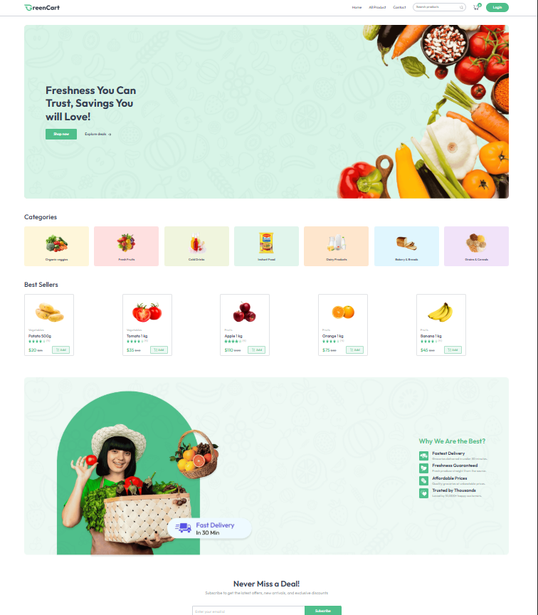
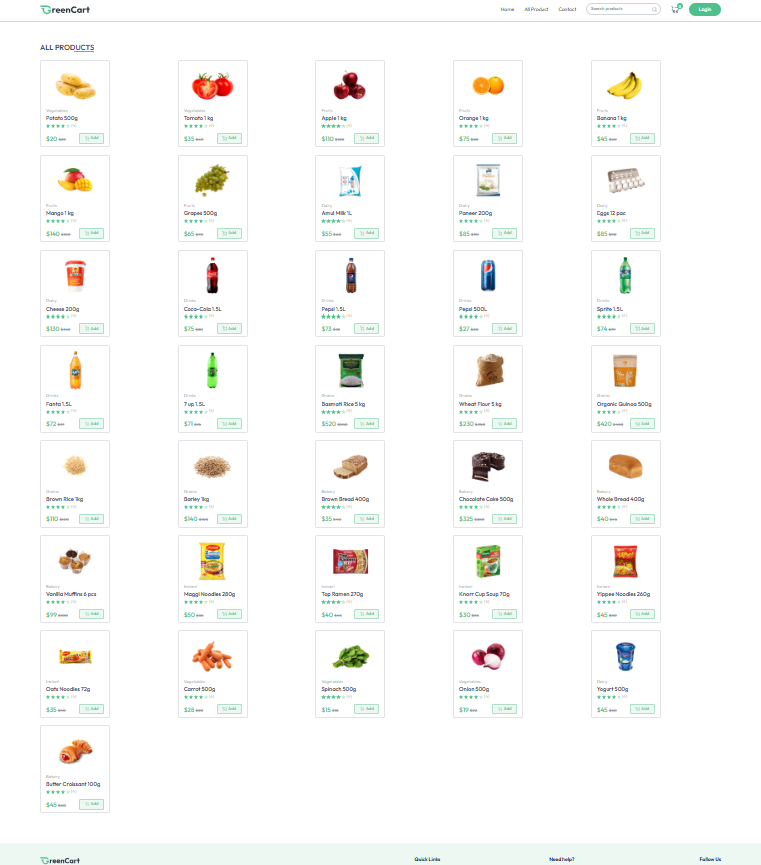

# 🛒 E-Commerce Website GreenCart
Full Stack Grocery Delivery Ecommerce website using **MongoDB**, **Express**, **React** and **Node JS**.

----------------------------

## 🔥 Features
- 🔐 User authentication (Register/Login)
- 🛍️ Product display with images and price
- 🖼️ Image gallery (click to change main image)
- 🔎 Product filtering (category/price)
- 📦 Add to cart & quantity update
- ✅ Checkout with Stripe payment
- 📄 Order history and details
- 📬 Address and delivery management
- 🧾 Admin panel (add/update products, view users/orders)
- 📱 Responsive design
- 📊 Dashboard stats (orders/users/revenue)
- 🌐 Deployed on Vercel (Frontend) & Render (Backend)
- 🧰 Technologies Used

--------------------------

##  💻 Technologies Used

**Frontend:**

- React
- React Router
- Axios
- Tailwind CSS

**Backend:**

- Node.js
- Express.js
- MongoDB + Mongoose
- Stripe Payment API

--------------

## ⚙️ Setup Instructions

### ✅ Prerequisites

- Node.js and npm
- MongoDB (Atlas or local)

### 🖥️ Frontend Setup

```bash
cd frontend
npm install
npm run dev

### 🛠️ Backend Setup

```bash
cd backend
npm install
npm run server


### 🖼️ Screenshots



### 🛒 Product Page




## 🔗 Live Demo Link

- 🌐 **Frontend**: [Vercel]()

- 🚀 **Backend**: API [Vercel](https://greencartserver-one.vercel.app)
